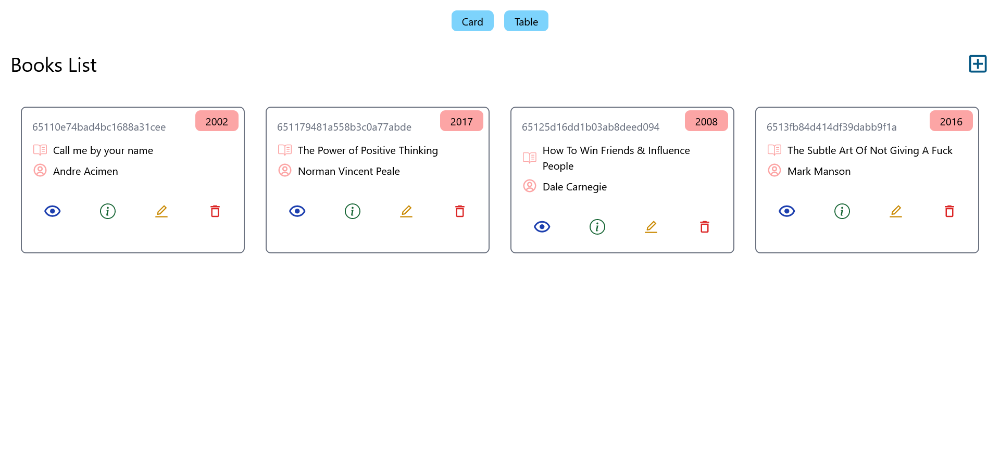

# FullStack Book Store App

## Screenshot

## Tech Stack Used

### Frontend

- HTML
- CSS
- JavaScript
- Tailwind CSS
- ReactJS
- Vite (for development and build)
- Git & GitHub (for version control and collaboration)
- React Router DOM (for client-side routing)
- Axios (for making API calls)
- Notistack (for displaying notifications)
- React Icons (for adding icons)

### Backend:

- Express.js
- Mongoose (for MongoDB database interaction)
- Nodemon (for automatic server restart during development)
- Cors (for handling Cross-Origin Resource Sharing)

## Key Features

### CRUD Operations

- Create new books by entering book name, author name, and publish year.
- Easily delete books you no longer need.
- Explore detailed book information on dedicated pages.
- Update book details to edit the content as needed.

### Dedicated Views

- Seamlessly navigate through separate pages for specific book actions:
  - Detail page for in-depth reading.
  - Edit page for content modifications.
  - Delete page for quick removal.
  - Home page for a comprehensive list of all books.

### Multiple Display Modes

- Choose between two convenient display modes:
  - Default card-based view.
  - Optional table-based view accessible via dedicated buttons.

### Modal Enhancements

- Enhance the card-based view with sleek and user-friendly modal windows for a better book browsing experience.

### User-Friendly Additions:

- Navigate effortlessly using the back button.
- Receive informative alerts to enhance the overall user experience.
   
   

**NOTE** : Please feel free to provide feedback on my work.

You can reach out to me on linkedin, this is my profile [LinkedIn](https://www.linkedin.com/in/kapil-kharera-191b83245/)
